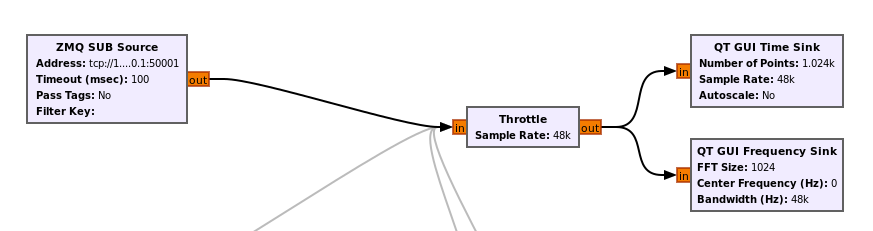
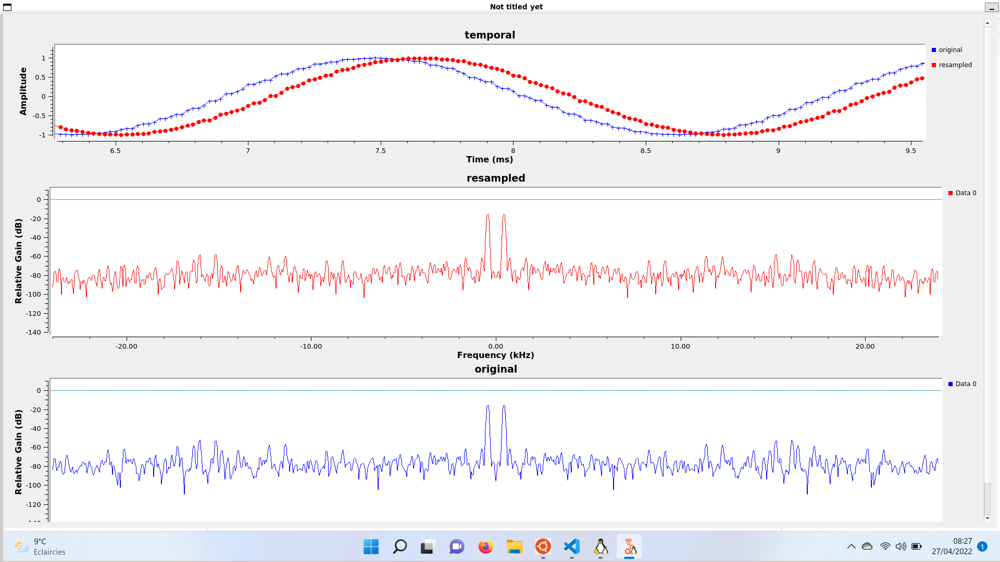

Oscillator Mixing
===================


An example to help work between GNU Radio Companion and FutureSDR.
It uses the ZeroMQ blocks.

## Compilation

```sh
sudo apt install libzmq3-dev
cd examples/oscillator-mixing
cargo build
```

## Running



On one side, open [viewer.grc](./viewer.grc) with your GNU Radio Companion and launch it.

On another side, launch the emitter with command:

```sh
cargo run
```

## Expected result

The emitter creates a 440Hz signal at a rate of 48kHz, then it downsample it at 44.1kHz and upsample it back at 48kHz. It also computes the difference of the original and resampled stream. Finally everything is sent to GNU Radio in a desynchronized way, ie 3 differents ZeroMQ stream.



And indeed the FFT display main harmonic at this 440Hz frequency for both signals. From a frequency perspective there is no noticeable difference. From the temporal perspective, the average absolute error is 0.0703 over a 10s window, so around 0.7% of error ...which is not good I guess but still not enough to hear the difference when use for audio.

NB: Actually it should be better to use a polyphase filterbank resampler (rather than my dumb linear resampler) as explained in [GNU Radio PFB block](https://github.com/gnuradio/gnuradio/blob/master/gr-filter/include/gnuradio/filter/pfb_arb_resampler.h).