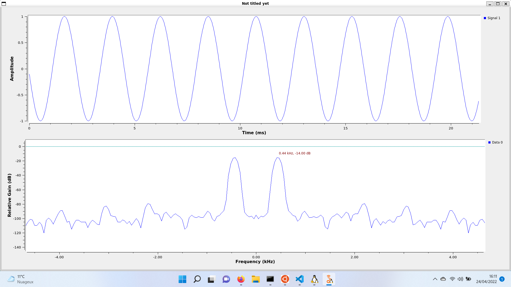

Oscillator Mixing
===================


An example to help work between GNU Radio Companion and FutureSDR.
It uses the ZeroMQ blocks.

## Compilation

```sh
sudo apt install libzmq3-dev
cd examples/oscillator-mixing
cargo build
```

## Running

On one side, open [viewer.grc](./viewer.grc) with your GNU Radio Companion and launch it.

On another side, launch the emitter with command:

```sh
cargo run
```

## Expected result

The emitter creates a 440Hz signal at a rate of 48kHz.



And indeed the FFT display main harmonic at this 440Hz frequency.

NB: somehow there is 2 throttles (one on each sides) so we might not be in good shape but it still works eventually.
