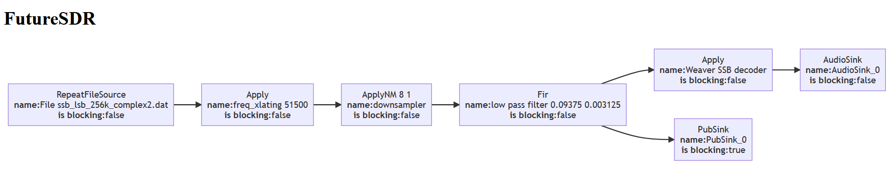

SSB
===

Examples of an SSB modulator (`receive`) and demodulator (`transmit`).

## Usage

### Receive

```
cargo run --release --bin receive
```

By default, this reads the file `ssb_lsb_256k_complex2.dat` and outputs the audio to your default audio device.

You can download that file from https://www.csun.edu/~skatz/katzpage/sdr_project/sdr/ssb_lsb_256k_complex2.dat.zip or by running `make ssb_lsb_256k_complex2.dat`



### Transmit

```
cargo run --release --bin receive INPUT OUTPUT
```

* `INPUT` must be an audio file with only one chanel (mono).
* `OUTPUT` will be a wave file containing the complex IQ data generated.

You can view/listen to it using an software define radio application like [SDR++](https://www.sdrpp.org/).

## Architecture

Goals is to achieve SSB decoding as in:
* https://wiki.gnuradio.org/index.php/Simulation_example:_Single_Sideband_transceiver
* http://www.csun.edu/~skatz/katzpage/sdr_project/sdr/grc_tutorial4.pdf

So really have same result as this [GNURadio flowgraph](./ssb-decoder.grc).
